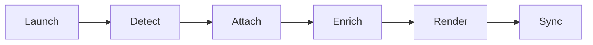

# delta-force-hawkops-enhancer 🦅⚙️

  

*A community-built companion overlay that gives Hawk Ops squads a sharper edge, faster loadouts, and cleaner situational awareness.*

  

---

### 🚀 3-Step Quick Start

1. **Grab the build** — hit the download button below to reach the landing page.

2. **Unzip & run** — no installer, no dependency chain, just a portable `.exe`.

3. **Launch Hawk Ops** — the overlay auto-detects the session and syncs instantly.

> [!TIP]
> Run it once before your first match so it can index your key bindings — subsequent launches are near-instant.

---

## 📡 Overview

`delta-force-hawkops-enhancer` is a community-maintained enhancement layer built specifically around the Hawk Ops mode inside Delta Force. It was born out of a simple frustration shared by thousands of squad leads: the stock HUD gives you just enough information to survive, but never enough to actually dominate a contract. This project fills that gap with overlay telemetry, loadout automation, and squad-callout tooling that respects the spirit of tactical play instead of trivializing it.

The tool exists because Hawk Ops rewards preparation and map literacy more than raw reflexes, and yet the default client offers almost no way to visualize that preparation in real time. Whether you're running solo contracts, coordinating a four-stack through extraction routes, or grinding faction reputation, this enhancer gives you a second set of eyes that never blinks. It's built by players who got tired of tab-alting to a spreadsheet mid-raid.

This project is for the tinkerers, the min-maxers, the squad IGLs who script their own callouts, and the everyday operator who just wants their overlay to feel like it was designed in 2026, not 2016. If you've ever wanted Hawk Ops to feel a little more like mission control and a little less like guesswork, you're in the right repository.

---

## 🧭 What's Under the Hood

| Capability | What It Actually Does |
|---|---|
| **Contract Radar Overlay** | Projects live contract objectives and rotation timers onto a translucent HUD layer that stays out of your crosshair. |
| **Squad Sync Beacon** | Shares positional callouts across your Hawk Ops fireteam without needing a third-party voice tool. |
| **Loadout Autopilot** | Remembers your last five loadouts per map and swaps presets with a single hotkey between contracts. |
| **Extraction Heatmap** | Learns extraction pressure zones from your match history and flags hot LZs before you commit. |
| **Faction Rep Tracker** | Tallies reputation gains live so you know exactly which contract tips you over the next tier. |
| **Audio Cue Sharpener** | Rebalances footstep and gunfire frequencies so directional cues cut through the mix cleanly. |
| **Session Recorder** | Lightweight clip capture triggered by kill-confirms, no background always-on recording bloat. |
| **Theme Engine** | Swap the entire overlay palette — tactical green, arctic white, or midnight amber — in two clicks. |

> [!NOTE]
> None of these modules touch game memory or packet streams — everything runs as an independent overlay reading only what's already rendered on screen.

---

## 🏁 How to Get Started

1. Visit the landing page via the download button and confirm you're on the latest tagged build.

2. Extract the archive to any folder — Desktop, a tools directory, a USB stick, doesn't matter.

3. Double-click the executable; Windows SmartScreen may prompt once on first run — click "More info → Run anyway."

4. Launch Delta Force, load into Hawk Ops, and the overlay will auto-attach within a few seconds.

> [!IMPORTANT]
> Always download from the official landing page linked in this README. Mirrors and third-party rehosts are not maintained by this project and may ship stale or altered builds.

---

## 🖥️ System Requirements

| Component | Minimum |
|---|---|
| OS | Windows 10 (64-bit) or Windows 11 |
| RAM | 4 GB free (overlay footprint is under 150 MB) |
| Storage | 80 MB free disk space |
| Dependencies | None — fully standalone, no runtime installs required |
| GPU | Any GPU capable of running Delta Force at 60+ FPS |

  

---

## ⚙️ How It Works

The overlay operates as a thin, read-only layer that observes what's already on your screen and enriches it — it never reaches into the game's internals.

1. **Launch detection** — the app watches for the Delta Force process and waits for Hawk Ops to load.

2. **Overlay attach** — a transparent DirectX-compatible layer mounts above the game window.

3. **Data enrichment** — contract, loadout, and map data get pulled from your local session cache.

4. **Render pass** — the HUD elements you enabled draw on top, synced to your refresh rate.

5. **Live sync** — squad beacon and rep tracker update continuously until you exit the match.

---

## 🩹 Troubleshooting

<strong>The overlay won't attach to Hawk Ops.</strong>

Make sure Delta Force is running in the same rendering mode (fullscreen/borderless) that you selected during first-run setup. A mismatch prevents the attach handshake.

<strong>My squad beacon shows teammates as offline.</strong>

All squad members need the same build version running. Version drift between teammates is the #1 cause of beacon desync.

<strong>Windows SmartScreen keeps blocking the executable.</strong>

This is expected for smaller independent tools without an EV code-signing certificate. Click "More info → Run anyway" — it's a one-time prompt per version.

<strong>Loadout Autopilot isn't remembering my presets.</strong>

Check that the settings folder isn't inside a directory with restricted write permissions, like `Program Files`. Move the tool to a user-writable folder.

<strong>The extraction heatmap looks empty on a new map.</strong>

Heatmaps build from your own match history — give it 3-5 contracts on that map before it has enough data to plot hot zones.

> [!WARNING]
> If any process asks for admin-level access beyond the initial SmartScreen prompt, close it immediately and re-download from the official landing page — that is not expected behavior for this tool.

---

## 🎨 UI / UX Details

- **Themes**: Tactical Green, Arctic White, Midnight Amber, and a colorblind-friendly High Contrast mode.

- **Keyboard Shortcuts**:

| Action | Shortcut |
|---|---|
| Toggle overlay visibility | `F9` |
| Cycle HUD themes | `F10` |
| Swap active loadout preset | `F6` |
| Open quick-settings panel | `Ctrl + Alt + H` |
| Force re-sync squad beacon | `Ctrl + Shift + B` |

- **Settings panel** is a single-window dashboard — no nested menu mazes, everything is one scroll away.

- **Opacity slider** for every HUD module independently, so radar can be bold while the rep tracker stays subtle.

> [!TIP]
> Bind the quick-settings shortcut to something you won't hit mid-firefight — `Ctrl + Alt + H` is the safe default for a reason.

---

## 🤝 Contributing & Community

This project grows because players who understand Hawk Ops better than any changelog contribute back. Whether you write C#, design HUD themes, or just file sharp bug reports from real matches, there's a place for you here.

> Good first issues are tagged `good-first-issue` and usually involve theme tweaks, translation strings, or small HUD element additions — a great low-pressure entry point.

- Fork the repo, branch off `main`, and keep PRs focused on one change at a time.

- Discuss bigger ideas in an issue first — we'd rather talk through architecture before code gets written.

- Every contributor gets credited in the release notes, no exceptions.

We welcome newcomers warmly — this started as a solo weekend project and it's community energy that turned it into something with staying power.

---

## 📜 License

Released under the [MIT License](LICENSE), 2026. Do good things with it.

---

## ⚖️ Disclaimer

This is an independent, community-driven overlay tool created by fans of Delta Force's Hawk Ops mode. It is not affiliated with, endorsed by, or sponsored by the game's publisher or developer. Use it responsibly, respect the game's terms of service, and understand that overlay tools of any kind may carry inherent risk depending on how a given title's anti-cheat policy is enforced. The maintainers assume no liability for account actions taken as a result of third-party software use.

